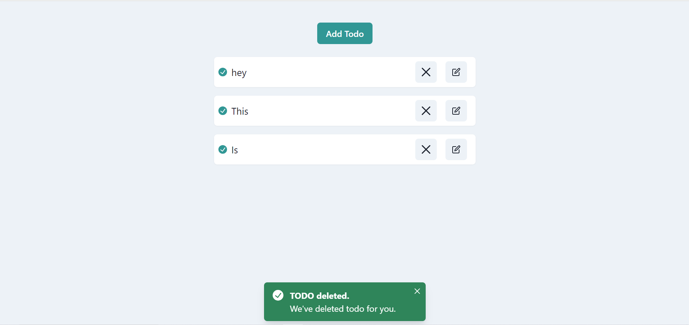
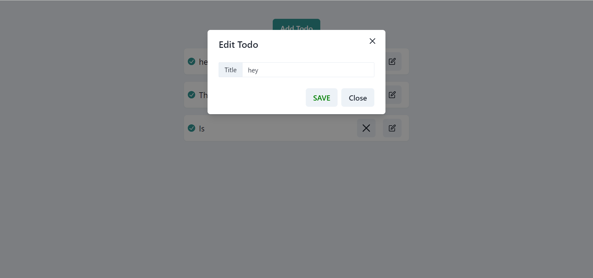

# Todo App with React, Redux, and Chakra UI

## Screenshots


*Screenshot of the Todo List view.*


*Screenshot of adding a new Todo.*


*Screenshot of updating a Todo.*

## Table of Contents

- [Introduction](#introduction)
- [Features](#features)
- [Technologies Used](#technologies-used)
- [Getting Started](#getting-started)
  - [Prerequisites](#prerequisites)
  - [Installation](#installation)
- [Running the App](#running-the-app)
- [Project Structure](#project-structure)

## Introduction

This is a simple Todo application built with React, Redux, and Chakra UI. It allows users to add, update, and delete todo items. The state management is handled using Redux Toolkit.

## Features

- Add new todo items
- Update existing todo items
- Delete todo items
- Responsive design using Chakra UI

## Technologies Used

- [React](https://reactjs.org/)
- [Redux](https://redux.js.org/)
- [Redux Toolkit](https://redux-toolkit.js.org/)
- [Chakra UI](https://chakra-ui.com/)
- [React Router](https://reactrouter.com/)

## Getting Started

### Prerequisites

Make sure you have the following installed on your machine:

- [Node.js](https://nodejs.org/) (v12 or later)
- [npm](https://www.npmjs.com/) or [yarn](https://yarnpkg.com/)

### Installation

1. Clone the repository:

   ```bash
   git clone https://github.com/your-username/todo-app.git
   cd todo-app
   ```

2. Install the dependencies:

   ```bash
   npm install
   ```
    OR 


   ```bash
   yarn install
   ```

## Running the App

1. Start the development server:

   ```bash
   npm run dev
   ```
    OR 


   ```bash
   yarn run dev
   ```

2. Open your browser and navigate to [http://localhost:5173](http://localhost:5173) to see the app in action.

## Project Structure
```
├── public
│   ├── index.html
├── src
│   ├── app
│   │   ├── store.ts
│   ├── components
│   │   ├── Todos
│   │   │   ├── AddTodo.tsx
│   │   │   ├── index.ts
│   │   │   ├── UpdateTodo.tsx
│   ├── features
│   │   ├── todo
│   │   │   ├── todoSlice.ts
│   │   │   ├── types.d.ts
│   ├── pages
│   │   ├── Todos.tsx
│   ├── App.tsx
│   ├── App.css
│   ├── Main.tsx
│   ├── reportWebVitals.ts
│   ├── setupTests.ts
├── README.md
├── package.json
├── tsconfig.json
```
